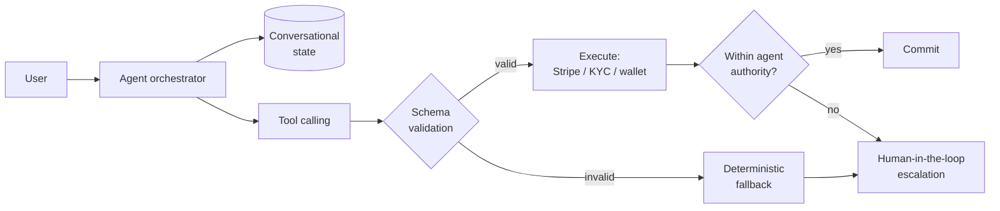

# Daniel Mawioo

**Senior Full-Stack Engineer** — TypeScript, Node.js, Python, PostgreSQL, Kubernetes.
Seven years building systems where being wrong has consequences: payments, regulated healthcare records, and global environmental data.

📍 **Nairobi, Kenya** — Open to relocating to the UK, North America & Germany.
🔗 [LinkedIn](https://linkedin.com/in/danielmawioo)

---

## What I work on

I build backends that stay correct under failure, and the interfaces and infrastructure around them. Most of my strongest work has been on the unglamorous half of a system — the retry that must not double-charge, the schema that has to survive a reporting peak, the audit trail that lets you reconstruct a decision six months later.

For the last two years I've been building production LLM agents on top of that foundation, which has made me fairly precise about where generative AI earns its place in an application and where it doesn't.

---

## Selected work

### BirdLife International — Senior Full-Stack Engineer *(2022 – present)*

A global conservation data platform used by scientists, field teams and partner institutions in **100+ countries**, supporting **16,000+ biodiversity site workflows**. I own architecture end to end — React/TypeScript interfaces, Node.js and Python services, PostgreSQL, and the AWS/Azure infrastructure beneath.

- Re-architected the PostgreSQL schemas with **table partitioning, materialised views and a rebuilt indexing strategy** — cut slow-query volume by **~60%** and API/page response times by **30–50%** under peak global reporting load.
- Led a legacy **PHP monolith into modular Node.js and Python microservices** without a big-bang cutover — defining service boundaries, versioned API contracts and a shared permission layer so old and new paths ran simultaneously.
- Built the observability stack — **Prometheus, Grafana, structured logging, distributed tracing** — and own incident response through to root cause, with the fix and its regression test going back into the backlog.
- Infrastructure as code in **Terraform**, containerised with **Docker**, CI/CD across dev/QA/UAT/production.

### Evermount — Fintech & AI-native platform *(2024 – present, built solo)*

A wealth-building and analytics platform I've built alone: product definition, architecture, backend, frontend, infrastructure. Private repository, so here's what's inside it.

**Stack:** NestJS + TypeScript · PostgreSQL via Prisma · React/Next.js · Redis · Docker · AWS S3 + Azure Blob Storage

**Money movement:** Stripe payment intents and webhooks, KYC verification, wallet and escrow patterns, OAuth, rate limiting — with idempotent handling throughout, because in payments the dangerous failure isn't the request that errors loudly, it's the one that quietly succeeds twice.

**Agent architecture:** a guided onboarding assistant that completes account setup without human handoff, plus CRM agents handling follow-up and support triage.

The interesting engineering wasn't getting a model to respond — it was deciding **what an agent may do alone**, what needs a deterministic fallback when output is unusable, and where a human must stay in the path. Every production-bound prompt and transaction path gets manual review.

### Earlier

- **Dang Group** *(2022, contract)* — Backend lead. Architected a multi-vendor commerce, payments and logistics platform from nothing in six months. Designed the background job pipelines with **retry logic, idempotency keys and dead-letter handling** that eliminated duplicate orders and lost payment events under partner retries. Established the engineering guidelines, API documentation standards and review practice for a distributed team that had none.
- **Tanaflow** *(2021, contract)* — Built a telemetry-driven payment-validation pipeline for US healthcare clients, with automated checks, **anomaly detection and real-time alerting** on suspicious transaction patterns. Services on Azure Kubernetes Service backed by Cosmos DB.
- **Lenox Technologies** *(2019 – 2021)* — Primary backend owner across regulated fintech and healthcare-records engagements for Miami-based clients. Granular **RBAC, tamper-evident audit trails and multi-tenant PostgreSQL schemas**, delivered inside customers' own infrastructure.

---

## Stack

| | |
|---|---|
| **Languages** | TypeScript, Python, JavaScript, SQL, Bash |
| **Backend** | Node.js, NestJS, Express, Python microservices, REST, GraphQL, event-driven architecture, message queues |
| **Frontend** | React, Next.js, TypeScript |
| **Data** | PostgreSQL (indexing, partitioning, materialised views, query optimisation), Redis, Prisma, Azure SQL, Cosmos DB |
| **Cloud & infra** | Microsoft Azure (App Service, AKS, Cosmos DB, Blob Storage, DevOps), AWS (S3, CloudFront), Kubernetes, Docker, Terraform, CI/CD |
| **Reliability** | Prometheus, Grafana, structured logging, distributed tracing, incident response, root cause analysis |
| **Security** | RBAC, OAuth, audit trails, multi-tenant isolation, rate limiting, Barracuda firewall administration |
| **AI** | OpenAI API, agent orchestration, tool calling, structured outputs, human-in-the-loop escalation; Cursor and Copilot in daily workflow |

---

## How I work

I use AI tooling heavily — Cursor and Copilot across coding, review, log analysis and test scaffolding — with one firm rule: **anything production-bound gets human review**. The rule exists because I've seen where model output is confidently wrong in ways that are expensive rather than obvious.

I've worked fully remotely and asynchronously across time zones for four years, mostly with people who understand their domain completely and software not at all. Turning that into something buildable is most of the job.

---

**B.Sc. Geospatial Information Science & Remote Sensing** — Dedan Kimathi University of Technology

Currently open to Senior Backend, Full-Stack and Platform Engineering roles in the UK.
Reach me on [LinkedIn](https://linkedin.com/in/danielmawioo).
